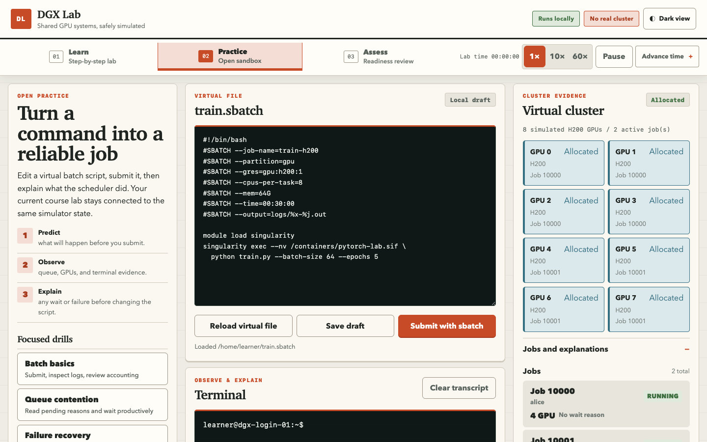

# DGX Lab

**Interactive SLURM Training Simulator**

DGX Lab is a standalone, deterministic simulation environment for learning SLURM and shared GPU-computing workflows. It presents a generic DGX-scale cluster, simulated concurrent users, synthetic AI workloads, failure scenarios, guided labs, and local certification. It is deliberately incapable of connecting to a real scheduler.

## Learning experience

Every module follows a consistent **Learn → Practice → Assess** rhythm. Learners receive one recommended action at a time, work entirely inside the simulated terminal, and advance only when the simulator observes the required evidence.

### Guided learning


**What to notice:** Module 1 begins with one concrete next action. The lab path separates current work from later evidence, while the terminal and virtual cluster keep the command and its scheduler effect visible together.

### Open practice



**What to notice:** Practice removes the step-by-step script without removing orientation. Learners use a predict, observe, explain loop, edit a virtual batch file, and compare the resulting queue and GPU state with terminal evidence.

### Failure recovery


**What to notice:** Module 9 turns an out-of-memory event into a diagnosis-and-recovery exercise. Warning colors are reserved for the affected GPU and failed job, and the next action asks learners to inspect accounting before changing the workload.

### Mobile capstone


**What to notice:** The same journey reflows for narrow screens. Controls remain touch-friendly, the recommended action stays prominent, and the capstone opens with an explicit evidence-backed objective rather than a compressed desktop layout.

This repository accompanies **DGX Lab PRD v1.0** and provides:

- a Tauri 2 desktop shell and static GitHub Pages web distribution over one Leptos/Rust/WASM application;
- a responsive Learn, Practice, and Assess interface;
- a deterministic simulation core with constrained virtual scheduler, shell, and filesystem;
- state-backed practical grading and an offline knowledge assessment;
- generic DGX-H200-8, contended, and degraded scenario sources;
- twelve guided course modules, each with a validated lab definition and learner guide;
- a certification blueprint and question bank;
- schemas, content validators, CI/release workflows, ADRs, authoring guides, and security tests;
- the approved PRD, four design-direction mockups, and verified runtime screenshots.

## Current implementation status

| Area | Status in this pack |
|---|---|
| Product and architecture documentation | Substantial |
| Functional static prototype | Runnable reference implementation |
| Pure Rust domain model | Implemented and tested |
| FIFO/resource scheduler | Deterministic and tested |
| Virtual filesystem and shell | Constrained and tested |
| Synthetic workload planner | Implemented and tested |
| Practical grading and knowledge scoring | State-backed and tested |
| Scenario compiler and report renderer | Implemented |
| Leptos CSR UI | Responsive release build produced |
| GitHub Pages distribution | Path-aware build and deployment workflow implemented |
| WASM worker API | Native/WASM boundary verified |
| Tauri 2 shell | Minimal, no real-system commands |
| Native/WASM compilation evidence | Verified in the current workspace |
| Cargo lockfile | Resolved and committed |
| Signed installers | Deferred to a signing/notarization release lane |

The current release has native Rust test evidence, a verified WebAssembly build, strict linting, browser QA at desktop and phone widths, validated course content, 241 requirement links, and a checksum-verified course pack. The browser build runs entirely client-side and never executes learner commands on the host.

## Public web distribution

The canonical web edition is built from `crates/web-ui` and deployed from `main` by `.github/workflows/pages.yml`. GitHub Pages receives a generated static artifact rather than the checked-in `dist/` reference snapshot. The workflow derives the repository project path, rebuilds the Leptos/WASM application, and rejects broken or root-hosted asset references before deployment.

Reproduce the project-site build locally with:

```bash
make web-pages PAGES_BASE=/DGX_Lab/
```

A repository administrator must select **GitHub Actions** as the Pages source before the first production deployment. See `docs/runbooks/GITHUB_PAGES.md` for setup, trust boundaries, custom-domain migration, and rollback.

## Fastest way to inspect the product

Serve the checked-in reference release build locally:

```bash
cd crates/web-ui/dist
python3 -m http.server 1421 --bind 127.0.0.1
```

Then open `http://127.0.0.1:1421`. The release includes all twelve labs, free practice, visual cluster evidence, failure recovery, and the capstone-gated readiness assessment. It never executes entered commands.

The no-build implementation in `prototype/` remains available as an early reference surface.

## Intended Rust/Tauri development flow

Install current stable Rust, the WASM target, Trunk, and Tauri CLI, then:

```bash
rustup target add wasm32-unknown-unknown
cargo install trunk --version 0.21.14 --locked
cargo install tauri-cli --version 2.11.4 --locked

python3 scripts/validate_all.py
cargo clippy --workspace --exclude web-ui --exclude sim-worker-wasm --exclude dgx-lab-desktop --all-targets -- -A clippy::manual_checked_ops -D warnings
cargo test --workspace --exclude web-ui --exclude sim-worker-wasm --exclude dgx-lab-desktop
cargo build -p sim-worker-wasm --target wasm32-unknown-unknown
cargo check -p web-ui --target wasm32-unknown-unknown
cargo tauri dev
```

See `docs/runbooks/LOCAL_DEVELOPMENT.md` for OS prerequisites and the build order.

## Architectural boundary

```text
GitHub Pages static host or Tauri 2 desktop shell
                         │
                         ▼
              Leptos CSR interface (WASM)
                         │
                         ▼
              Rust simulation worker (WASM)
                         │
                         ├── virtual scheduler
                         ├── virtual users
                         ├── virtual shell/filesystem
                         ├── synthetic workloads
                         ├── grading and assessment
                         └── deterministic event replay

NO SSH · NO SHELL · NO REAL SLURM · NO RUNTIME EXTERNAL NETWORK
```

The default cluster profile generalizes an eight-H200, 224-logical-CPU, cgroup-isolated Slurm environment into non-institutional names and paths. Production hostnames, IP addresses, credentials, and operational paths are intentionally absent.

## Important directories

```text
crates/                 Rust workspace crates
src-tauri/              Minimal Tauri 2 desktop shell
prototype/              No-build functional browser prototype
scenario-src/           Human-authored cluster/scenario YAML
course-src/             Course and lab Markdown/YAML
question-src/           Knowledge bank and certification blueprint
schemas/                JSON Schemas for portable content
scripts/                Validation and security tooling
docs/                   Architecture, ADRs, authoring, runbooks, handoff
assets/mockups/          Approved high-fidelity UI directions
assets/screenshots/      Verified runtime screenshots used in this README
```

## Primary next milestone

Produce signed and notarized desktop artifacts, add automated visual-regression coverage, and run structured usability sessions with learners while preserving the no-network, no-host-shell boundary. See `docs/MILESTONES.md` and `docs/handoff/NEXT_ACTIONS.md`.

## Licensing

- Code: Apache License 2.0
- Built-in original course content: CC BY 4.0
- Product name and marks: see `TRADEMARKS.md`
- Third-party dependencies: to be generated from the resolved `Cargo.lock` before release
